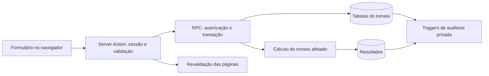

# Arquitetura e implantação

## Stack definida

| Camada | Tecnologia | Responsabilidade |
| --- | --- | --- |
| Interface e servidor web | Next.js com TypeScript | Páginas, componentes, validações de interface e rotas de servidor quando necessárias. |
| Estilos | Tailwind CSS | Interface responsiva para celular e computador. |
| Hospedagem | Vercel | Build, deploy automático e versões de preview conectadas ao GitHub. |
| Banco de dados | Supabase PostgreSQL | Dados de usuários, pontuações, torneios, participantes, regras e resultados. |
| Autenticação | Supabase Auth | Cadastro, login e sessão do usuário. |
| Autorização | Supabase Row Level Security (RLS) | Restringe acesso aos dados conforme usuário, participação e organização do torneio. |

## Estrutura de segurança

- O navegador usa somente as variáveis públicas `NEXT_PUBLIC_SUPABASE_URL` e `NEXT_PUBLIC_SUPABASE_PUBLISHABLE_KEY`.
- A chave privilegiada `SUPABASE_SERVICE_ROLE_KEY`, quando indispensável, fica apenas em rotas executadas no servidor e nas variáveis protegidas da Vercel.
- Toda tabela exposta no schema público deve ter RLS habilitado e políticas explícitas de leitura e escrita.
- Pontuação pessoal só pode ser criada ou alterada pelo respectivo jogador, salvo fluxos administrativos definidos para um torneio.
- Organizador só pode administrar torneios que criou e seus participantes.

## Fluxo implementado — Sprints 3 e 4

A stack da ADR-001 permanece. O fluxo implementado usa Server Actions do Next.js para validar formulários e sessão, seguidas de funções RPC no PostgreSQL executadas com a identidade autenticada. As RPCs públicas de escrita usam `SECURITY DEFINER`, `search_path` fixo e verificam explicitamente identidade, organização do torneio e estado antes de alterar dados. RLS protege as leituras diretas; as escritas do cliente nas tabelas de torneios, participantes, resultados e pontuações pessoais continuam sem políticas que as autorizem diretamente. A aplicação não utiliza chave de serviço nesses fluxos.

As páginas de servidor também consultam tabelas sob RLS e RPCs de leitura autorizadas. `SECURITY DEFINER` não substitui autorização: essas funções executam com privilégios do proprietário e precisam fazer a própria checagem. A S4-02 disponibiliza nome/e-mail de contas cadastradas somente após validar que o solicitante organiza o torneio informado. A busca tem paginação de 25 contas; não altera a política de leitura de perfis nem expõe e-mails no ranking. Como qualquer usuário pode criar um torneio, qualquer usuário que passe a organizar um também pode acessar essa seleção; não há papel de administrador global adicional.

## Modelo de dados e consistência — S4-01 e S4-02

| Elemento | Implementação e efeito |
| --- | --- |
| Encerramento | `tournaments.closed_at` registra o encerramento explícito, permitido após o último dia e a conferência histórica quando houver participantes. As operações da aplicação bloqueiam edição e recálculo de torneios encerrados. |
| Preparação histórica | `history_ready`, existente desde a Sprint 3, controla se ausências podem gerar penalidades. A S4-02 adiciona a conclusão pela interface; alterar participantes preserva esse estado. |
| Elegibilidade | `tournament_participants.eligible_from`, existente desde a Sprint 3, passa a ser gerenciado pela interface. A chave do vínculo é composta por torneio e jogador. |
| Pontuação pessoal | Continua pertencendo ao jogador, com unicidade jogador/dia. Adicionar ou remover participação não altera nem exclui essa pontuação. |
| Resultados | Inclusão, mudança de elegibilidade e remoção recalculam somente o torneio alvo. Mudanças na composição podem alterar a diferença relativa dos demais participantes. Resultados removidos por alteração do vínculo são auditados. |
| Auditoria | `private.tournament_changes` e `private.participant_changes` complementam os registros de pontuações e resultados existentes. Guardam ator, instante e valores anteriores/novos; a S4-02 registra também a remoção de resultados. Sem acesso direto pelos papéis de cliente. |

Mutações de participação e recálculo ocorrem na mesma transação, com bloqueio da linha do torneio. Os lançamentos pessoais também bloqueiam os torneios envolvidos, serializando alterações nos dados compartilhados. Não há fila, serviço de cálculo separado ou tarefa agendada introduzida nestas entregas. O encerramento é manual; não existe exclusão automática depois de uma semana. Relatório, e-mail e retirada do torneio da aplicação continuam como RF19 futuro.

A administração usa `/dashboard/tournaments` e `/dashboard/tournaments/[id]/participants`. O painel dos jogadores ainda consulta o torneio de setembro; navegação e resultados de múltiplos torneios para participantes são S4-03.

A tela de participantes renderiza grids compactos por meio de `ParticipantGrid`, componente de cliente com data editável e ações por linha. Cada linha reutiliza a Server Action `manageParticipant`; confirmações são apresentadas ao submeter a ação, e as validações/autorização continuam no servidor e no banco. Essa revisão visual não introduz RPCs, alterações de esquema ou novas regras de cálculo.

## Migrações e proteção da referência

- `202609260001_tournament_management.sql`: estado de encerramento, auditoria de torneios e RPCs de criação, edição e encerramento.
- `202609260002_participant_management.sql`: seleção de contas, administração de vínculos, conclusão histórica e auditoria de participação/remoção de resultados. Sua aplicação não altera os dados de negócio existentes nem recalcula o ranking.

Aplicar cada migração uma vez e antes de publicar o código dependente. O backup de referência da S4-02 fica em tabela privada no Supabase e em `backups/sprint-4/`, ignorada pelo Git. A comparação verifica dados, resultados e cálculo na data de referência; ela não restaura automaticamente os dados e não substitui backup integral da plataforma. Execução da segunda migração confirmada pelo Dono do produto, com zero diferenças antes/depois. Ensaio de inclusão/remoção na interface confirmado pelo Dono do produto, com zero diferenças após o ciclo; homologação dos demais cenários ainda pendente. Ver [Sprint 4](sprints/sprint-4.md) e [backup](sprints/sprint-4-backup.md).

## Ambientes e publicação

| Ambiente | Finalidade | Origem |
| --- | --- | --- |
| Desenvolvimento | Trabalho local dos integrantes. | Branch de funcionalidade. |
| Preview | Revisar uma alteração antes de integrá-la. | Pull request. |
| Produção | Versão publicada para uso. | Branch `main`. |

O repositório GitHub será conectado à Vercel. Cada pull request gera uma versão de preview; alterações aprovadas e integradas à `main` geram o deploy de produção. Segredos e chaves não devem ser incluídos no Git: ficam configurados como variáveis de ambiente por ambiente na Vercel.

## Limites do plano gratuito

O plano gratuito da Vercel é compatível com o caráter acadêmico e não comercial do projeto. O plano gratuito do Supabase atende ao MVP, mas o projeto pode ser pausado após uma semana sem atividade. Antes de demonstrações ou entregas, o grupo deve acessar o sistema e confirmar que banco, autenticação e deploy estão ativos.

## Referências

- https://vercel.com/docs/frameworks/full-stack/nextjs
- https://vercel.com/docs/environment-variables
- https://supabase.com/docs/guides/auth
- https://supabase.com/docs/guides/database/postgres/row-level-security
