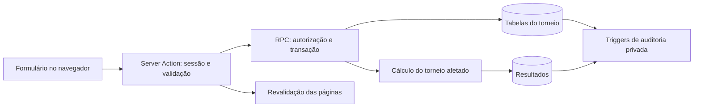

# Arquitetura e implantação

Situação consolidada em 03/10/2026: migrações S5 aplicadas pelo Dono do produto, com comparação pós-migração de regra única sem diferenças. Interface exercitada e cenários relatados aprovados: regra única, ranking, recarga, alteração/restauração do período, calendário, exclusões e modos. TESTE S5 retirado; quatro torneios originais e lançamentos legítimos preservados, com capturas privadas exportadas/validadas. URL e identificação formal do deployment não fornecidas. Aceite global/encerramento da Sprint 5 ainda não confirmados.

Registros abaixo preservam a situação de cada etapa; pendências anteriores de aplicação/comparação da migração foram resolvidas pela evidência acima.

## Arquitetura vigente da edição de regras — complemento S5

Regra única por torneio implementada em `202610030002_single_tournament_rule.sql`, aplicada e verificada no Supabase pelo Dono do produto. Para abertos, última revisão é canônica para todo o período; anteriores guardam configuração/período históricos. `effective_from/to` registram período da alteração, sem vigência independente de novas revisões. Encerrados conservam cálculo/resultados. RLS/grants permanecem.

Tela conjunta envia período real e regra com `scope: tournament`; contrato antigo é rejeitado. Prévia simula período proposto sem gravação e token cobre pontuações nos períodos antigo e novo. Confirmação grava versão, datas/parâmetros atuais de `tournaments`, auditoria e recálculo atomicamente; reconcilia dias removidos/acrescentados. Elegibilidade/vínculos e brutos preservados. Trigger de referência inicial atua somente na criação; revisões não alteram linhas históricas. RPC antiga de edição permite nome, mas rejeita datas diferentes sem prévia.

Migração recusa última revisão parcial em aberto e não reescreve dados/resultados. Scripts 10–12 capturam/exportam/comparam estado atual; comparação pós-migração antes de uso. Recuperação anterior ao uso da entrega inicial não desfaz complemento após uso. [ADR-004](decisoes/adr-004-regra-unica-por-torneio.md), [diagrama vigente](diagramas/regras-versionadas.md). Descrição por intervalos mais abaixo preserva desenho anterior, substituído para novas edições.

## Stack definida

| Camada | Tecnologia | Responsabilidade |
| --- | --- | --- |
| Interface e servidor web | Next.js com TypeScript | Páginas, componentes, validações de interface e rotas de servidor quando necessárias. |
| Estilos | Tailwind CSS | Interface responsiva para celular e computador. |
| Hospedagem | Vercel | Build, deploy automático e versões de preview conectadas ao GitHub. |
| Banco de dados | Supabase PostgreSQL | Dados de usuários, pontuações, torneios, participantes, regras e resultados. |
| Autenticação | Supabase Auth | Cadastro, login e sessão do usuário. |
| Autorização | Supabase Row Level Security (RLS) | Restringe acesso aos dados conforme usuário, participação e organização do torneio. |

## Estrutura de segurança

- O navegador usa somente as variáveis públicas `NEXT_PUBLIC_SUPABASE_URL` e `NEXT_PUBLIC_SUPABASE_PUBLISHABLE_KEY`.
- A chave privilegiada `SUPABASE_SERVICE_ROLE_KEY`, quando indispensável, fica apenas em rotas executadas no servidor e nas variáveis protegidas da Vercel.
- Toda tabela exposta no schema público deve ter RLS habilitado e políticas explícitas de leitura e escrita.
- Pontuação pessoal só pode ser criada ou alterada pelo respectivo jogador, salvo fluxos administrativos definidos para um torneio.
- Organizador só pode administrar torneios que criou e seus participantes.

## Fluxo implementado — Sprints 3 e 4

A stack da ADR-001 permanece. O fluxo implementado usa Server Actions do Next.js para validar formulários e sessão, seguidas de funções RPC no PostgreSQL executadas com a identidade autenticada. As RPCs públicas de escrita usam `SECURITY DEFINER`, `search_path` fixo e verificam explicitamente identidade, organização do torneio e estado antes de alterar dados. RLS protege as leituras diretas; as escritas do cliente nas tabelas de torneios, participantes, resultados e pontuações pessoais continuam sem políticas que as autorizem diretamente. A aplicação não utiliza chave de serviço nesses fluxos.

```mermaid
flowchart LR
  UI[Formulário no navegador] --> SA[Server Action: sessão e validação]
  SA --> RPC[RPC: autorização e transação]
  RPC --> DB[(Tabelas do torneio)]
  RPC --> CALC[Cálculo do torneio afetado]
  CALC --> RESULTS[(Resultados)]
  DB --> AUDIT[Triggers de auditoria privada]
  RESULTS --> AUDIT
  SA --> CACHE[Revalidação das páginas]
```

As páginas de servidor também consultam tabelas sob RLS e RPCs de leitura autorizadas. `SECURITY DEFINER` não substitui autorização: essas funções executam com privilégios do proprietário e precisam fazer a própria checagem. A S4-02 disponibiliza nome/e-mail de contas cadastradas somente após validar que o solicitante organiza o torneio informado. A busca tem paginação de 25 contas; não altera a política de leitura de perfis nem expõe e-mails no ranking. Como qualquer usuário pode criar um torneio, qualquer usuário que passe a organizar um também pode acessar essa seleção; não há papel de administrador global adicional.

## Modelo de dados e consistência — S4-01 e S4-02

| Elemento | Implementação e efeito |
| --- | --- |
| Encerramento | `tournaments.closed_at` registra o encerramento explícito, permitido após o último dia e a conferência histórica quando houver participantes. As operações da aplicação bloqueiam edição e recálculo de torneios encerrados. |
| Preparação histórica | `history_ready`, existente desde a Sprint 3, controla se ausências podem gerar penalidades. A S4-02 adiciona a conclusão pela interface; alterar participantes preserva esse estado. |
| Elegibilidade | `tournament_participants.eligible_from`, existente desde a Sprint 3, passa a ser gerenciado pela interface. A chave do vínculo é composta por torneio e jogador. |
| Pontuação pessoal | Continua pertencendo ao jogador, com unicidade jogador/dia. Adicionar ou remover participação não altera nem exclui essa pontuação. |
| Resultados | Inclusão, mudança de elegibilidade e remoção recalculam somente o torneio alvo. Mudanças na composição podem alterar a diferença relativa dos demais participantes. Resultados removidos por alteração do vínculo são auditados. |
| Auditoria | `private.tournament_changes` e `private.participant_changes` complementam os registros de pontuações e resultados existentes. Guardam ator, instante e valores anteriores/novos; a S4-02 registra também a remoção de resultados. Sem acesso direto pelos papéis de cliente. |

Mutações de participação e recálculo ocorrem na mesma transação, com bloqueio da linha do torneio. Os lançamentos pessoais também bloqueiam os torneios envolvidos, serializando alterações nos dados compartilhados. Não há fila, serviço de cálculo separado ou tarefa agendada introduzida nestas entregas. O encerramento é manual; não existe exclusão automática depois de uma semana. Relatório, e-mail e retirada do torneio da aplicação continuam como RF19 futuro.

A administração usa `/dashboard/tournaments` e `/dashboard/tournaments/[id]/participants`. O painel lista os torneios acessíveis por RLS e navega em abas por `/dashboard?tournament=<uuid>`. A consulta `get_tournament_dashboard(uuid)` verifica identidade e vínculo/organização, bloqueia a linha do torneio, revalida o acesso e usa o recálculo existente somente no alvo. A resposta reúne metadados, participantes, exclusões e resultados do mesmo torneio. A RPC antiga de setembro delega à nova para compatibilidade. Pontuação e histórico pessoal permanecem globais. Fluxo em [diagrama de navegação](diagramas/navegacao-torneios.md).

A tela de participantes renderiza grids compactos por meio de `ParticipantGrid`, componente de cliente com data editável e ações por linha. Cada linha reutiliza a Server Action `manageParticipant`; confirmações são apresentadas ao submeter a ação, e as validações/autorização continuam no servidor e no banco. Essa revisão visual não introduz RPCs, alterações de esquema ou novas regras de cálculo.

## Migrações e proteção da referência

- `202609260003_multiple_tournaments.sql`: consulta parametrizada de resultados e compatibilidade de setembro; sem mutação de dados na aplicação. Execução remota confirmada pelo Dono do produto em 27/09/2026, com comparação posterior sem diferenças.

- `202609260001_tournament_management.sql`: estado de encerramento, auditoria de torneios e RPCs de criação, edição e encerramento.
- `202609260002_participant_management.sql`: seleção de contas, administração de vínculos, conclusão histórica e auditoria de participação/remoção de resultados. Sua aplicação não altera os dados de negócio existentes nem recalcula o ranking.

Aplicar cada migração uma vez e antes de publicar o código dependente. O backup de referência da S4-02 fica em tabela privada no Supabase e em `backups/sprint-4/`, ignorada pelo Git. A comparação verifica dados, resultados e cálculo na data de referência; ela não restaura automaticamente os dados e não substitui backup integral da plataforma. Execução da segunda migração confirmada pelo Dono do produto, com zero diferenças antes/depois. Ensaio de inclusão/remoção na interface confirmado pelo Dono do produto, com zero diferenças após o ciclo; demais cenários funcionais da S4-02 e S4-03 homologados pelo Dono do produto em 27/09/2026. Ver [Sprint 4](sprints/sprint-4.md) e [backup](sprints/sprint-4-backup.md).

## Ambientes e publicação

| Ambiente | Finalidade | Origem |
| --- | --- | --- |
| Desenvolvimento | Trabalho local dos integrantes. | Branch de funcionalidade. |
| Preview | Revisar uma alteração antes de integrá-la. | Pull request. |
| Produção | Versão publicada para uso. | Branch `main`. |

O repositório GitHub será conectado à Vercel. Cada pull request gera uma versão de preview; alterações aprovadas e integradas à `main` geram o deploy de produção. Segredos e chaves não devem ser incluídos no Git: ficam configurados como variáveis de ambiente por ambiente na Vercel.

## Limites do plano gratuito

O plano gratuito da Vercel é compatível com o caráter acadêmico e não comercial do projeto. O plano gratuito do Supabase atende ao MVP, mas o projeto pode ser pausado após uma semana sem atividade. Antes de demonstrações ou entregas, o grupo deve acessar o sistema e confirmar que banco, autenticação e deploy estão ativos.

## Referências

- https://vercel.com/docs/frameworks/full-stack/nextjs
- https://vercel.com/docs/environment-variables
- https://supabase.com/docs/guides/auth
- https://supabase.com/docs/guides/database/postgres/row-level-security

## Desenho inicial de regras por intervalo — histórico substituído pelo ADR-004

Calendário vigente: `monday_to_friday` ou `every_day` (sábado e domingo incluídos), conforme a definição funcional da Sprint 5. Migração preparatória `202610030000_all_days_calendar.sql` adiciona o valor ao enum em transação separada. O valor legado de segunda a sexta mais domingos é somente compatibilidade histórica; novas propostas o rejeitam e a interface não o oferece. Recuperação anterior ao uso mantém o enum ampliado, sem alterar o cálculo do código antigo.

`tournament_rule_versions` torna-se a fonte canônica de modo, penalidade, semana e exclusões por intervalo. Referência inicial cobre o torneio; maior ID que cobre cada data prevalece. RLS permite leitura aos participantes/organizador; escrita ocorre somente por RPC autorizada. Fuso global fixo São Paulo, sem configuração, garantido por constraint em `tournaments`; snapshots conservam o fuso como evidência. Campos legados e exclusões antigas permanecem por compatibilidade, sem representar necessariamente revisões posteriores.

Criação configurada é atômica; trigger dá referência a clientes antigos. `calculate_tournament` mantém assinatura, selecionando versão por dia. `refresh_open_tournament` reconcilia resultados e remove dias fora do calendário, com auditoria de remoção existente. Encerrados preservam resultados. Painel retorna regra da data de referência e histórico autorizado; interface diária usa a versão do snapshot, e avisos de lançamento usam o calendário da data atual.

Server Actions validam sessão e entrada; banco revalida organizador/estado e bloqueia torneio em prévia/confirmação. Token de frescor cobre proposta e entradas; confirmação reconstrói prévia antes de inserir versão, auditar impacto em `private.rule_revision_changes` e recalcular na mesma transação. Scores e vínculos seguem o protocolo de bloqueio do torneio existente. Detalhes, limitações e decisões em [ADR-003](decisoes/adr-003-regras-versionadas.md) e [fluxo/modelo](diagramas/regras-versionadas.md). Situação histórica dessa implementação inicial, substituída pela consolidação atual no início deste documento; [operação](sprints/sprint-5-operacao.md) inclui captura atual e recuperação restrita ao estágio anterior ao uso.

## Perfil público — detalhamento S4-04/S4-05

`profiles` recebe `public_name_confirmed` e `geoguessr_url`. Índice de nome normalizado global impede colisões; perfis antigos ficam sem confirmação, sem alteração de nomes/UUIDs. `update_my_profile` valida e edita somente o titular em transação, com auditoria `private.profile_changes`. Políticas de insert/update direto removidas; select próprio mantido. Cadastro envia nome em metadados ao trigger de Auth, que valida e aplica a mesma unicidade. A RPC de disponibilidade anônima informa somente booleano.

A página `/dashboard/profile` usa Server Action e RPC autenticada. RPCs de torneios/participantes retornam nome confirmado (ou rótulo neutro) e link para contas autorizadas; seleção de candidatos não expõe links. `PlayerName` renderiza o link validado sem substituir o nome. Não existe integração servidor-a-servidor com GeoGuessr. A inclusão histórica de setembro mantém assinatura, mas não sobrescreve perfil.

Migração `202609270001_public_profiles.sql`, publicação e homologação confirmadas pelo Dono do produto em 27/09/2026. Decisões e efeitos sobre legado em [ADR-002](decisoes/adr-002-perfil-publico.md), modelo em [Classes](diagramas/classes.md) e fluxo em [Perfil público](diagramas/perfil-publico.md).

Carga complementar autorizada do Excel: operação administrativa única `20260927-import-mvp-profiles.sql`, sem nova tabela, RPC ou permissão de aplicação. Resolve as identidades previamente confirmadas, bloqueia Auth/perfis durante a transação, valida todos os registros antes da escrita e usa a auditoria existente. Confirma somente os nomes importados e preserva URL quando ausente na fonte; conflitos abortam. Execução remota confirmada para 12 nomes e 11 URLs; Martin excluído para preservar seu perfil manual. Fluxo de uso normal e diagramas permanecem iguais.

## S5-04 — Apresentação reduzida dos resultados diários

`TournamentView` permanece no servidor: consulta completa existente, filtro de elegibilidade, ranking de todos os resultados e montagem dos detalhes diários. `RecentResults`, componente de cliente, recebe conteúdos diários serializáveis e mostra cinco dias ou todos conforme estado local. Chave pelo ID do torneio reinicia apresentação ao trocar de seleção; `useId` liga botão/região, com foco visível e anúncio da contagem. Não altera RPCs, banco, autenticação, permissões, cálculos ou gravações.

É limite de apresentação, sem paginação de dados: resultados completos continuam consultados/transferidos. Não demonstra redução de latência e não implementa FB06. Histórico pessoal usa o mesmo componente com estado independente: cinco lançamentos iniciais, expansão dos até 100 registros carregados pelo servidor com filtro do jogador e RLS, incluindo dias fora dos calendários dos torneios. Lista de torneios mantida. Implementação local; publicação/homologação de S5-04 ainda pendentes. Decisão funcional e validação na Sprint 5.
## S5-05 — Carregamento, recuperação e tempos de consulta

Entrada do painel usa loading.tsx; TournamentPanel recebe abas autorizadas e conteúdo do servidor. Link/onNavigate e router.push em useTransition identificam a seleção solicitada; resultados anteriores são substituídos por status enquanto pendente. Prefetch das abas desabilitado, pois a RPC atual pode atualizar resultados. RetryLoad atualiza a rota em falhas de consulta; error.tsx oferece retry() para exceções. Sem cache privado nem alterações de autorização, transações ou modelo.

measureDashboardQuery registra tempos/resultado/código normalizado no servidor, com session_claims no proxy de /dashboard e demais etapas na página. Não registra dados pessoais. O fluxo de cookies permanece igual. Medidas incluem transporte e não isolam SQL, bloqueios, inicialização ou renderização do navegador. Causa da demora não confirmada; publicação/medição/homologação pendentes. [ADR-005](decisoes/adr-005-carregamento-e-diagnostico-do-painel.md).
