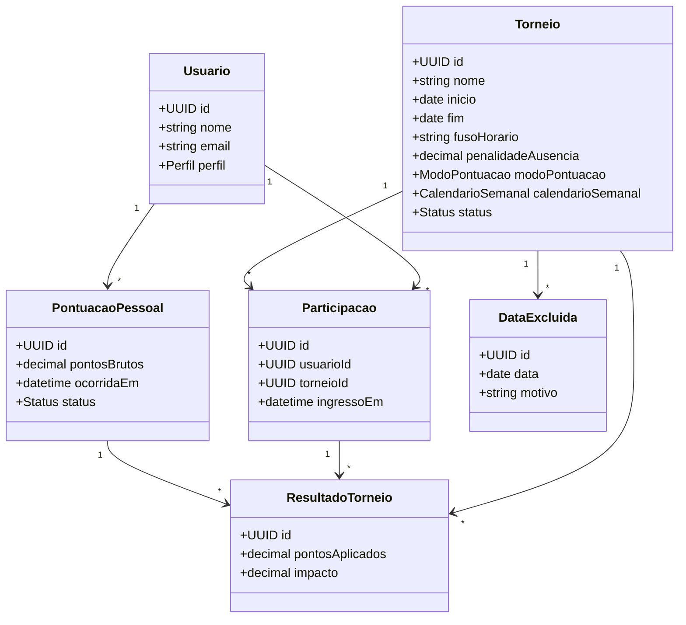
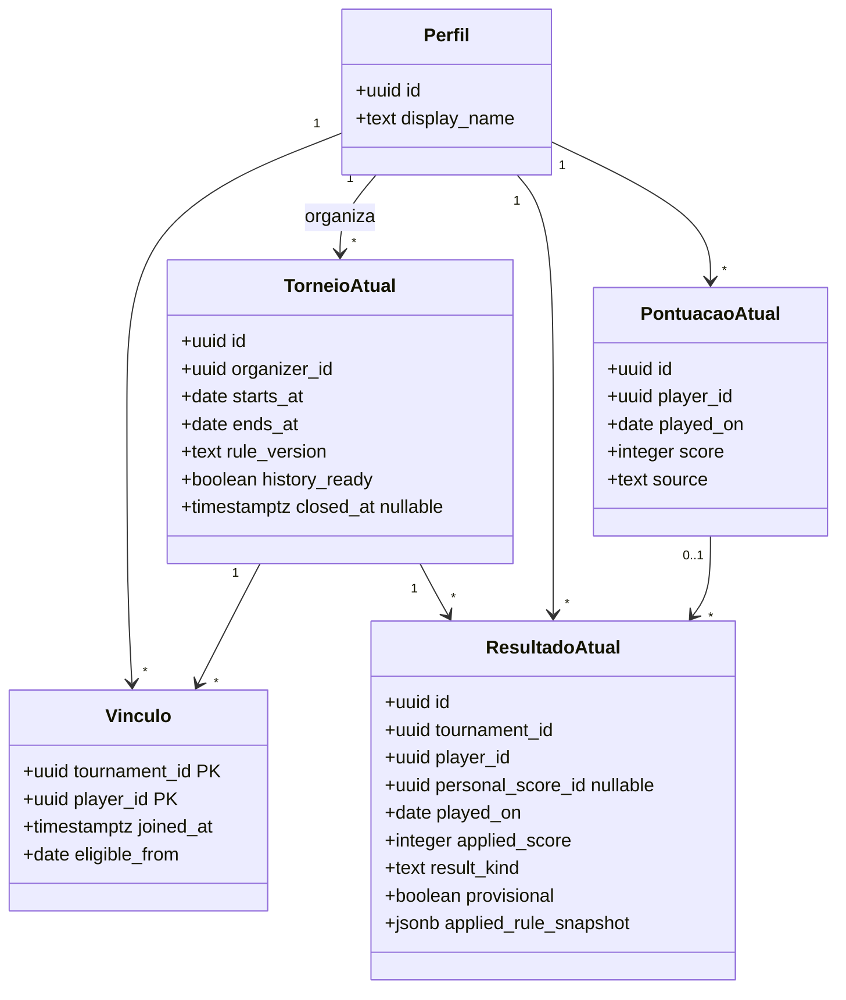

# Diagrama de classes inicial

O primeiro diagrama preserva o modelo conceitual da descoberta. O diagrama ao final descreve os principais campos e vínculos efetivamente implementados até S4-02.

`PontuacaoPessoal` não pertence a um torneio. `ResultadoTorneio` registra como uma pontuação pessoal foi calculada dentro de determinado torneio, preservando o resultado quando a configuração mudar.

## Modelo implementado até S4-02

`Perfil` corresponde a `public.profiles`; e-mail pertence a `auth.users` e só é retornado na seleção administrativa autorizada. Ausências podem gerar resultados sem `personal_score_id`. O resultado é único por torneio/jogador/dia; a pontuação pessoal é única por jogador/dia. O diagrama omite campos auxiliares, exclusões de calendário e tabelas privadas de auditoria, detalhadas em [Arquitetura](../arquitetura.md).
