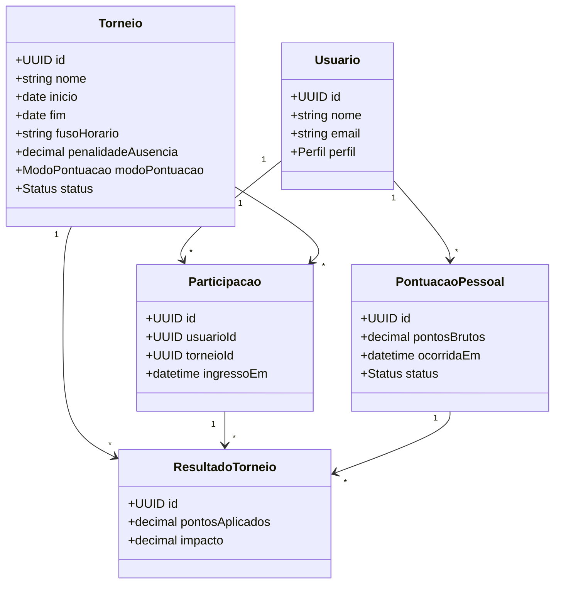

# Diagrama de classes inicial

`PontuacaoPessoal` não pertence a um torneio. `ResultadoTorneio` registra como uma pontuação pessoal foi calculada dentro de determinado torneio, preservando o resultado quando a configuração mudar.
