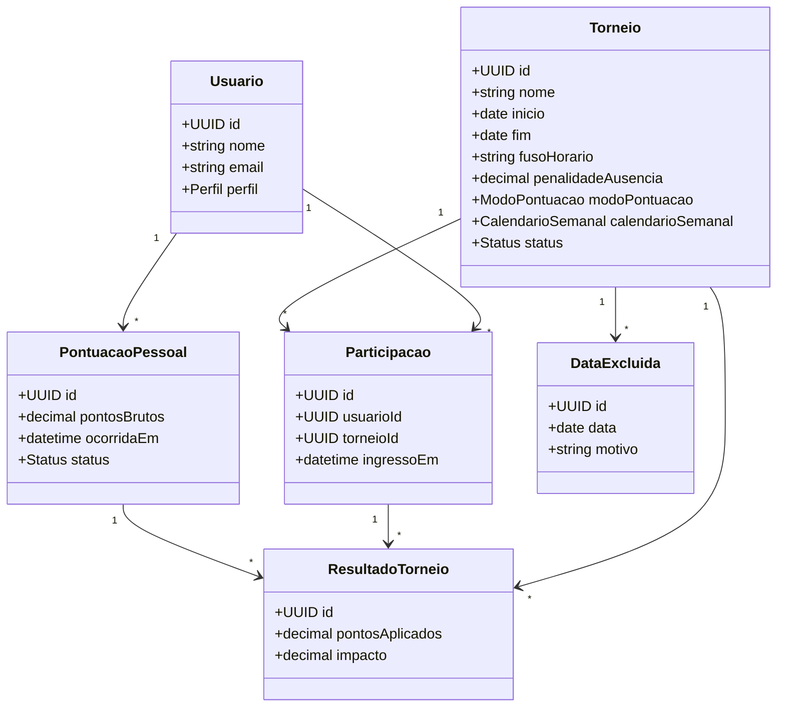
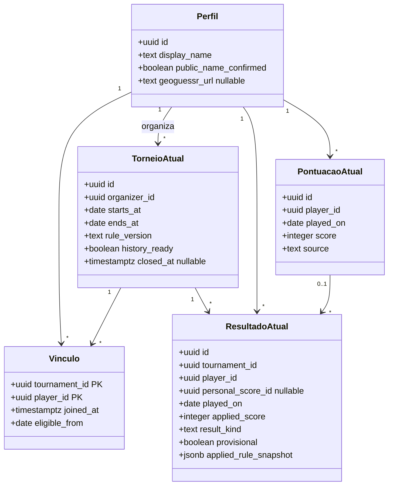
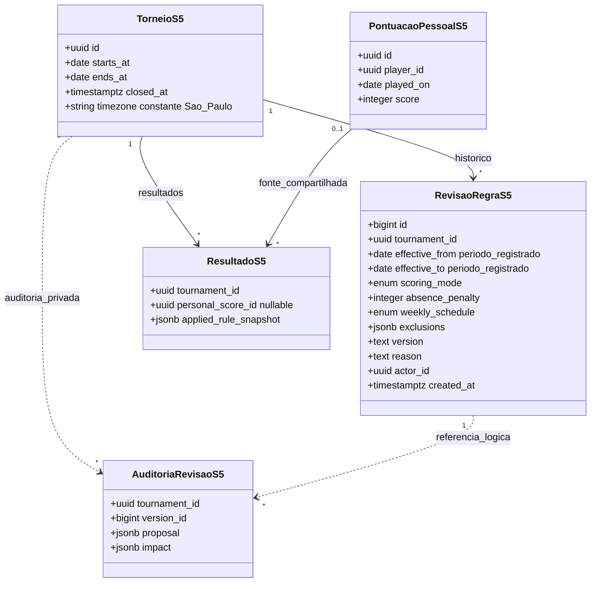

# Diagrama de classes inicial

Modelo vigente S5: regra única por torneio aberto, histórico imutável de configurações/períodos e auditoria privada. São Paulo é constante, sem configuração. Resultados identificam regra via snapshot; pontuação pessoal é compartilhada. Migrações aplicadas/verificadas e cenários relatados conferidos pelo Dono do produto. Os diagramas iniciais abaixo são históricos; o complemento S5 está ao final e no [modelo/fluxo de regras](regras-versionadas.md).

O primeiro diagrama preserva o modelo conceitual da descoberta. O diagrama ao final descreve os principais campos e vínculos efetivamente implementados localmente até S4-05.

```mermaid
classDiagram
  class Usuario {
    +UUID id
    +string nome
    +string email
    +Perfil perfil
  }
  class Torneio {
    +UUID id
    +string nome
    +date inicio
    +date fim
    +string fusoHorario
    +decimal penalidadeAusencia
    +ModoPontuacao modoPontuacao
    +CalendarioSemanal calendarioSemanal
    +Status status
  }
  class Participacao {
    +UUID id
    +UUID usuarioId
    +UUID torneioId
    +datetime ingressoEm
  }
  class PontuacaoPessoal {
    +UUID id
    +decimal pontosBrutos
    +datetime ocorridaEm
    +Status status
  }
  class ResultadoTorneio {
    +UUID id
    +decimal pontosAplicados
    +decimal impacto
  }
  class DataExcluida {
    +UUID id
    +date data
    +string motivo
  }
  Usuario "1" --> "*" Participacao
  Torneio "1" --> "*" Participacao
  Usuario "1" --> "*" PontuacaoPessoal
  Torneio "1" --> "*" ResultadoTorneio
  Torneio "1" --> "*" DataExcluida
  Participacao "1" --> "*" ResultadoTorneio
  PontuacaoPessoal "1" --> "*" ResultadoTorneio
```

`PontuacaoPessoal` não pertence a um torneio. `ResultadoTorneio` registra como uma pontuação pessoal foi calculada dentro de determinado torneio, preservando o resultado quando a configuração mudar.

## Modelo implementado localmente até S4-05

```mermaid
classDiagram
  class Perfil {
    +uuid id
    +text display_name
    +boolean public_name_confirmed
    +text geoguessr_url nullable
  }
  class TorneioAtual {
    +uuid id
    +uuid organizer_id
    +date starts_at
    +date ends_at
    +text rule_version
    +boolean history_ready
    +timestamptz closed_at nullable
  }
  class Vinculo {
    +uuid tournament_id PK
    +uuid player_id PK
    +timestamptz joined_at
    +date eligible_from
  }
  class PontuacaoAtual {
    +uuid id
    +uuid player_id
    +date played_on
    +integer score
    +text source
  }
  class ResultadoAtual {
    +uuid id
    +uuid tournament_id
    +uuid player_id
    +uuid personal_score_id nullable
    +date played_on
    +integer applied_score
    +text result_kind
    +boolean provisional
    +jsonb applied_rule_snapshot
  }
  Perfil "1" --> "*" TorneioAtual : organiza
  Perfil "1" --> "*" Vinculo
  TorneioAtual "1" --> "*" Vinculo
  Perfil "1" --> "*" PontuacaoAtual
  TorneioAtual "1" --> "*" ResultadoAtual
  Perfil "1" --> "*" ResultadoAtual
  PontuacaoAtual "0..1" --> "*" ResultadoAtual
```

`Perfil` corresponde a `public.profiles`; e-mail pertence a `auth.users` e só é retornado na seleção administrativa autorizada. Ausências podem gerar resultados sem `personal_score_id`. O resultado é único por torneio/jogador/dia; a pontuação pessoal é única por jogador/dia. O diagrama omite campos auxiliares, exclusões de calendário e tabelas privadas de auditoria, detalhadas em [Arquitetura](../arquitetura.md).

Complemento S5: TorneioAtual tem uma configuração única para todo o período editável. Versões anteriores registram configurações/períodos históricos, sem regras simultaneamente aplicáveis em torneios abertos. Confirmação altera período/regra e reconcilia resultados atomicamente, preservando PontuacaoAtual e Vinculo. Ver [diagrama de regras](regras-versionadas.md) e [ADR-004](../decisoes/adr-004-regra-unica-por-torneio.md). Migração complementar aplicada e verificada; homologação dos cenários relatados confirmada, aceite global pendente.

## Modelo de regras efetivamente implementado — S5

```mermaid
classDiagram
  class TorneioS5 {
    +uuid id
    +date starts_at
    +date ends_at
    +timestamptz closed_at
    +string timezone constante Sao_Paulo
  }
  class RevisaoRegraS5 {
    +bigint id
    +uuid tournament_id
    +date effective_from periodo_registrado
    +date effective_to periodo_registrado
    +enum scoring_mode
    +integer absence_penalty
    +enum weekly_schedule
    +jsonb exclusions
    +text version
    +text reason
    +uuid actor_id
    +timestamptz created_at
  }
  class AuditoriaRevisaoS5 {
    +uuid tournament_id
    +bigint version_id
    +jsonb proposal
    +jsonb impact
  }
  class ResultadoS5 {
    +uuid tournament_id
    +uuid personal_score_id nullable
    +jsonb applied_rule_snapshot
  }
  class PontuacaoPessoalS5 {
    +uuid id
    +uuid player_id
    +date played_on
    +integer score
  }
  TorneioS5 "1" --> "*" RevisaoRegraS5 : historico
  TorneioS5 "1" --> "*" ResultadoS5 : resultados
  TorneioS5 "1" ..> "*" AuditoriaRevisaoS5 : auditoria_privada
  RevisaoRegraS5 "1" ..> "*" AuditoriaRevisaoS5 : referencia_logica
  PontuacaoPessoalS5 "0..1" --> "*" ResultadoS5 : fonte_compartilhada
```

Última revisão governa todo o período atual de torneios abertos; revisões anteriores são somente histórico. Setas pontilhadas de auditoria indicam vínculos lógicos, sem FK/cascata: retirada de TESTE S5 preservou esses registros. Resultado referencia a versão textual pelo snapshot, sem FK para a revisão. Vínculos/perfis do modelo S4 permanecem.
