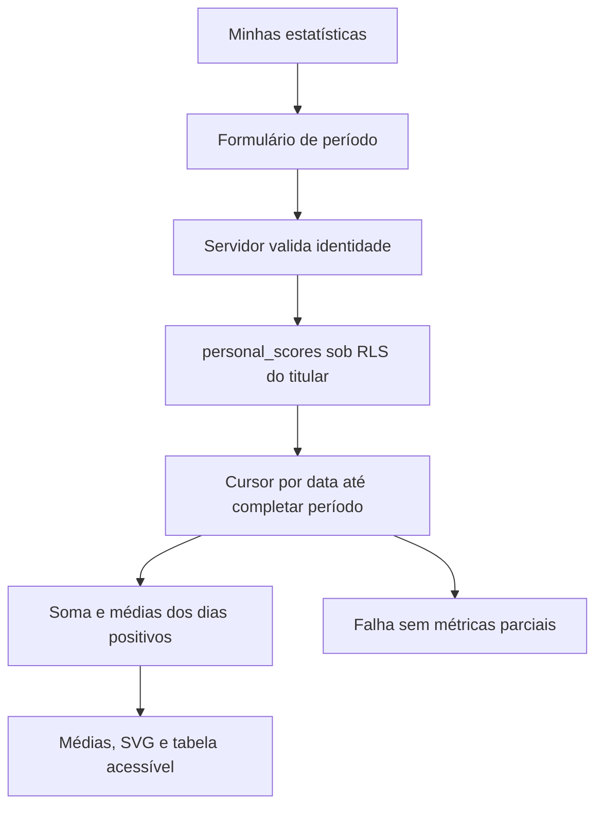

# Estatísticas pessoais — RF20

```mermaid
flowchart TD
  Painel[Minhas estatísticas] --> Tela[Formulário de período]
  Tela --> Sessao[Servidor valida identidade]
  Sessao --> Consulta[personal_scores sob RLS do titular]
  Consulta --> Paginas[Cursor por data até completar período]
  Paginas --> Calculo[Soma e médias dos dias positivos]
  Calculo --> Resultado[Médias, SVG e tabela acessível]
  Paginas --> Erro[Falha sem métricas parciais]
```

Sem positivos: estado vazio. Sem novo modelo, RPC ou mutação. Fonte bruta pessoal independente das auditorias de torneio. Publicação e homologação pendentes.
