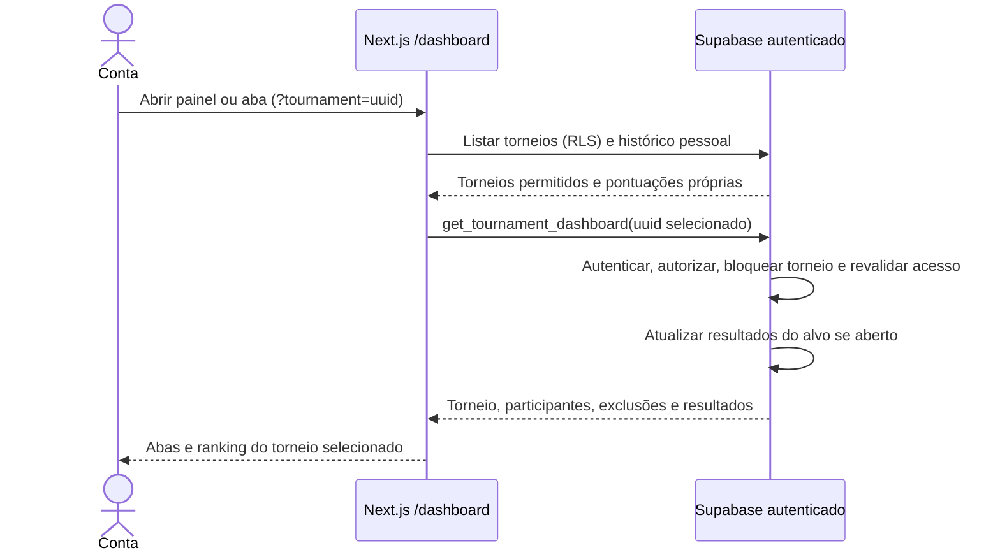

# Navegação entre torneios — S4-03

Evolução local S5 em 03/10/2026: o painel autorizado passa a retornar também versão da data de referência e histórico de regras; cálculo escolhe versão por dia, avisos usam calendário atual e legendas diárias usam snapshots. [Fluxo de revisão](regras-versionadas.md). O fluxo aceito da S4-03 abaixo continua como base; migração/publicação S5 ainda pendentes.

Seleção inválida não chama a RPC pela interface. A RPC também protege chamadas diretas. Encerrados preservam os resultados existentes. Sem mudanças no modelo de dados; o diagrama de classes da S4-02 permanece válido. Migração confirmada e aplicação publicada homologada pelo Dono do produto em 27/09/2026.
