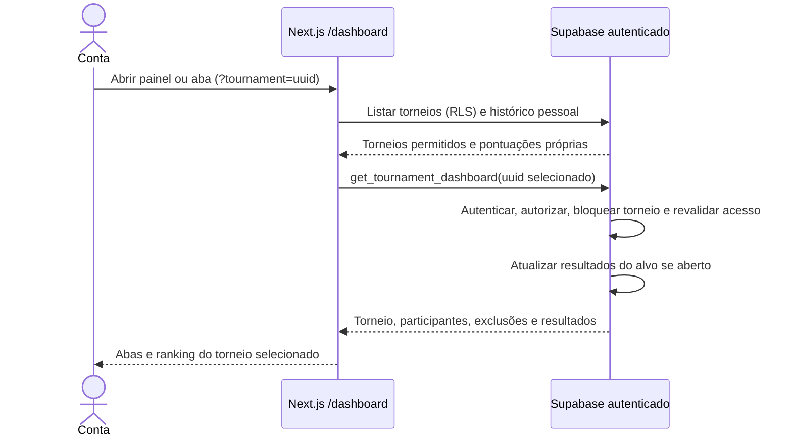

# Navegação entre torneios — S4-03

Seleção inválida não chama a RPC pela interface. A RPC também protege chamadas diretas. Encerrados preservam os resultados existentes. Sem mudanças no modelo de dados; o diagrama de classes da S4-02 permanece válido. Migração e publicação da S4-03 ainda pendentes.
