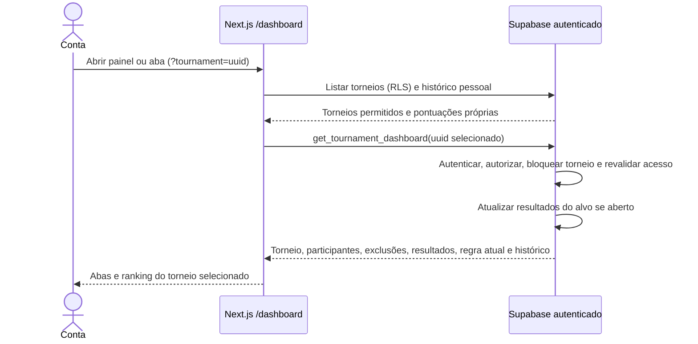
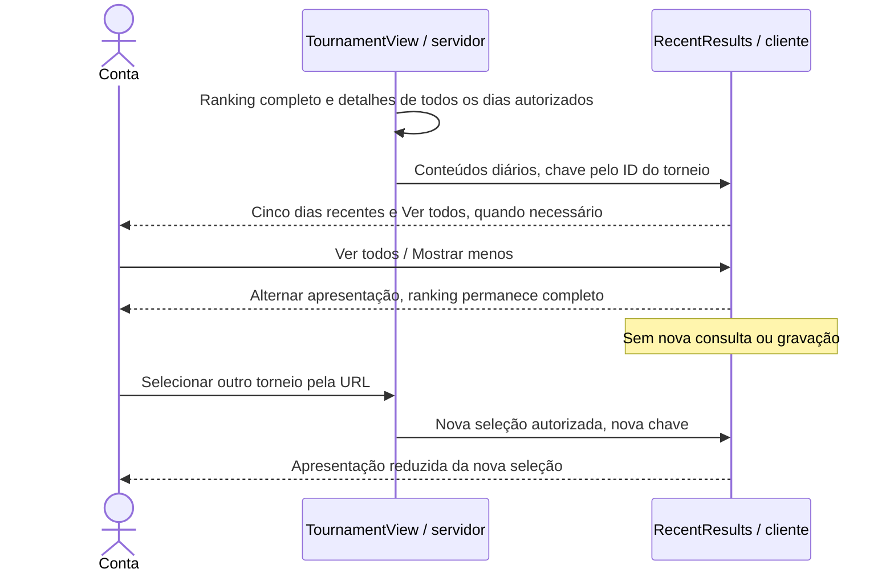

# Navegação entre torneios — S4-03

Situação S5 em 03/10/2026: painel retorna a regra única atual do torneio aberto e seu histórico de alterações; resultados diários guardam snapshots, avisos usam o calendário atual. Edição conjunta de período/regra está em /dashboard/tournaments/id/rules, com prévia e confirmação. Migrações aplicadas/verificadas e cenários relatados conferidos pelo Dono do produto; aceite global pendente. [Fluxo de revisão](regras-versionadas.md). O fluxo aceito de S4-03 abaixo permanece como base.

Seleção inválida não chama a RPC pela interface. A RPC também protege chamadas diretas. Encerrados preservam os resultados existentes. Na S4-03 não houve mudança de modelo; a S5 acrescentou histórico de regras/auditoria, conforme o [modelo atualizado](classes.md) e ADR-004. Migração confirmada e aplicação publicada homologada pelo Dono do produto em 27/09/2026.

## S5-04 — Expansão local de dias

Conteúdos completos continuam transferidos; limite apenas de apresentação. Implementação local, publicação/homologação adicional pendentes.