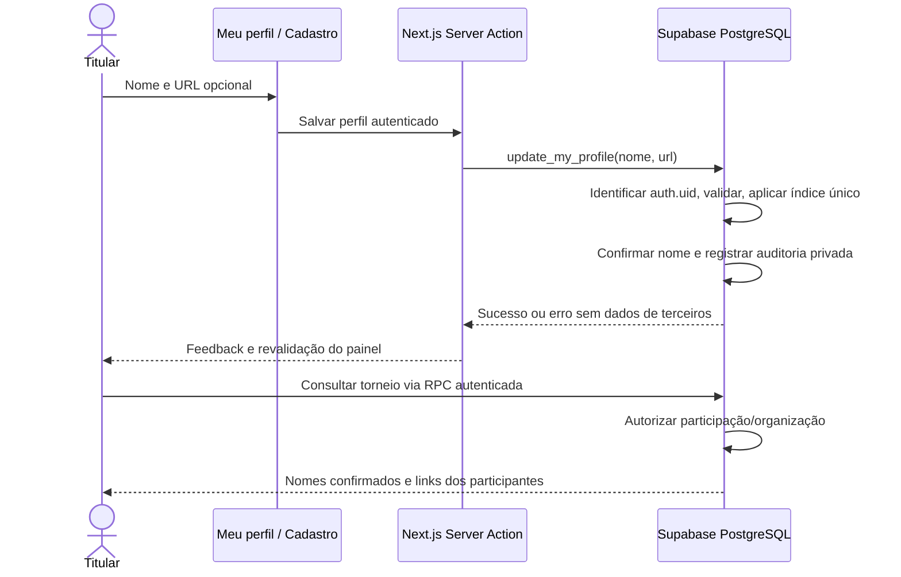

# Perfil público — S4-04/S4-05

Cadastro usa Supabase Auth e trigger de criação, com validação e índice único. Leitura direta de perfis é limitada ao próprio usuário. Link GeoGuessr é navegação externa do navegador, sem busca ou importação no servidor. Implementação local, implantação e homologação pendentes.
