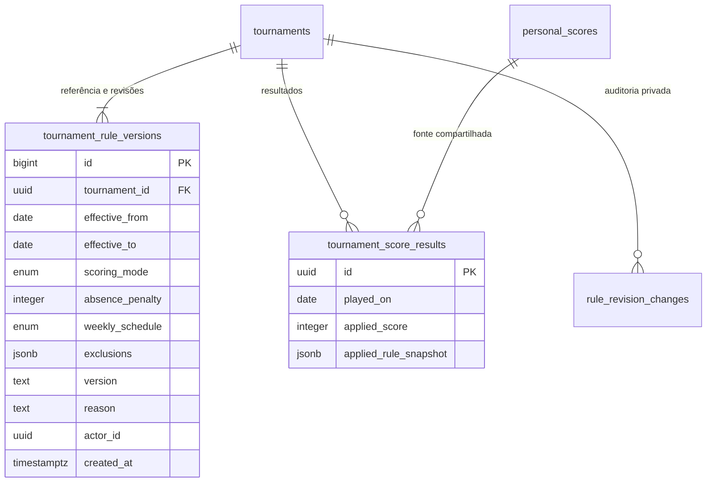

# Regras versionadas — Sprint 5 (implementação local)

```mermaid
sequenceDiagram
  actor Organizador
  participant Tela as Next.js /tournaments/id/rules
  participant RPC as Supabase autenticado
  participant Dados as Torneio, versões e resultados
  Organizador->>Tela: Definir intervalo, configuração e motivo
  Tela->>RPC: preview_tournament_rules
  RPC->>Dados: Autorizar organizador e bloquear torneio aberto
  RPC->>Dados: Ler entradas e simular regra por data
  RPC-->>Tela: Totais, diferenças e token de frescor
  Tela-->>Organizador: Conferir impacto sem gravação
  Organizador->>Tela: Confirmar revisão explícita
  Tela->>RPC: apply_tournament_rules(proposta, token)
  RPC->>Dados: Reautorizar, bloquear e conferir base
  alt Base mudou ou torneio encerrado
    RPC-->>Tela: Rejeitar; exigir nova prévia
  else Base permanece válida
    RPC->>Dados: Inserir versão e auditoria do impacto
    RPC->>Dados: Recalcular, auditar alterações e remoções
    Note over RPC,Dados: Uma transação; falha desfaz tudo
    RPC-->>Tela: Revisão aplicada
    Tela-->>Organizador: Resultado e histórico atualizados
  end
```



Por data, a maior revisão que cobre o intervalo vence; referência inicial garante cobertura. O snapshot guarda o identificador textual da versão, sem nova FK nos resultados legados. Fuso global fixo São Paulo, fora da configuração. Versões são consultáveis por participantes/organizador, auditoria é privada. Nenhuma execução remota ou homologação implícita neste diagrama.
